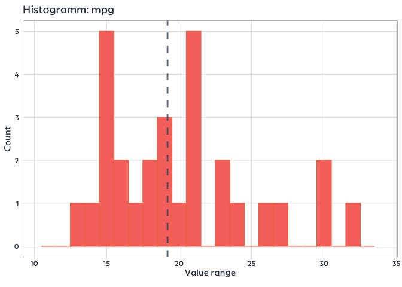

# DataVizR

## Prerequisites

It is mandatory to install Europace fronts beforehand.

## Installation

``` r
# install.packages("devtools")
devtools::install_github("deadhand7/data-viz-r")
```

    ## 
    ##   
       checking for file ‘/private/var/folders/3k/blvv82wx4s51szc4cpw0gg0c0000gp/T/Rtmp02WQyc/remotes10c133ac5c216/deadhand7-data-viz-r-8d4c9e8/DESCRIPTION’ ...
      
    ✔  checking for file ‘/private/var/folders/3k/blvv82wx4s51szc4cpw0gg0c0000gp/T/Rtmp02WQyc/remotes10c133ac5c216/deadhand7-data-viz-r-8d4c9e8/DESCRIPTION’
    ## 
      
    ─  preparing ‘DataVizR’:
    ##    checking DESCRIPTION meta-information ...
      
    ✔  checking DESCRIPTION meta-information
    ## 
      
    ─  checking for LF line-endings in source and make files and shell scripts
    ## 
      
    ─  checking for empty or unneeded directories
    ## 
      
    ─  building ‘DataVizR_0.1.0.tar.gz’
    ## 
      
       
    ## 

## Overview

The package provides a palette based on Europace color codes and a
custom theme which uses the Europace fronts. Additionally, some flexible
quick-access plotting functions are included.

### Main Functions

  - `ep.theme()`
  - `scale.fill.ep()`
  - `scale.color.ep`
  - `plot.histogram`
  - `plot.density`
  - `plot.boxplot`

### Customize an existing ggplot

``` r
iris %>% 
  ggplot(aes(x = Species, y = Sepal.Width, fill = Species)) +
  geom_violin() +
  scale.fill.ep('cool') +
  ep.theme()
```

<!-- -->

### Histogram

``` r
plot.histogram(df = mtcars, x = mpg, binwidth = 1, ticks = 5)  
```

<!-- -->

### Facets

``` r
DataVizR::plot.histogram(df = iris, x = Petal.Width, binwidth = 1, facet = Species, ticks = 3)  
```

<!-- -->

### Density Plot

``` r
plot.density(df = mtcars, x = qsec)  
```

<!-- -->

### Box-Plot

``` r
plot.boxplot(df = iris, x = Species, y = Sepal.Length, fill = Species, x.lab = 'Species', ticks = 4)
```

<!-- -->
